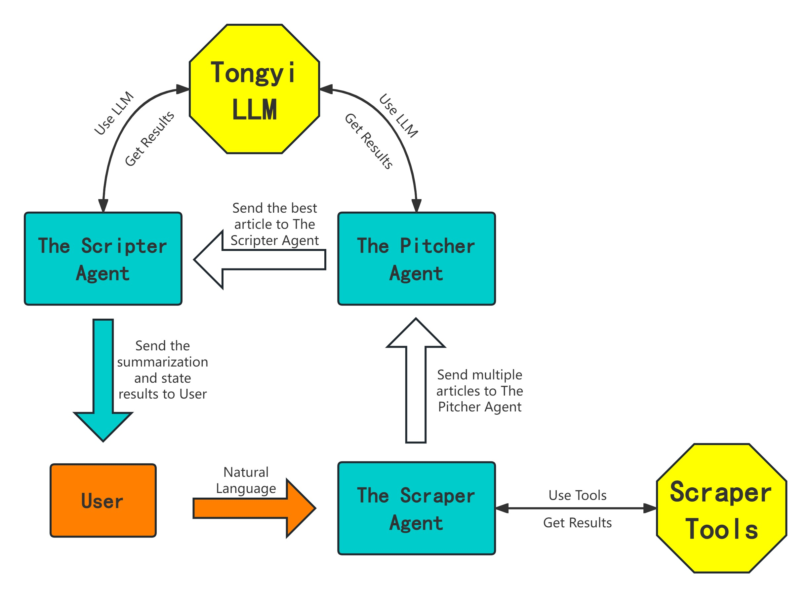

# SpaceNews Agents 🌌🛰️

A Python-based project designed to collect and pitch and summarize recent news about space and satellites. The project categorizes news by country/region and selects the top news for each region, providing a concise summary for easy reading.

This project was deployed in a docker container on AI-1 server.

Try the [SpaceNews Agents streamlit app](http://192.168.148.59:8502/)

## Features ✨

- 📰 Collects news articles about space and satellites from the past week
- 🌍 Categorizes news by country/region
- 🏆 Utilizes a Pitcher Agent to select the top news for each region
- 📝 Uses a Scripter Agent to summarize the selected news in under 150 words
- ⚙️ Compiles the Pitcher Agent & Scripter Agent by LangGraph
- 🌐 Develops a Streamlit web interface
- 📄 Generates a downloadable user-friendly docx document with summarized news



## Installation (Conda) 🛠️

To install and set up the project, follow these steps:

1. Clone the repository:
    ```bash
    git clone https://github.com/Zifeng-Jiang/News_agent.git
    ```
2. Navigate to the project directory:
    ```bash
    cd News_agent
    ```
3. Create and activate a virtue environment(Conda):
    ```bash
    conda create --name news_agent
    conda activate news_agent
    ```
4. Install the required dependencies:
    ```bash
    pip install -r requirements.txt
    ```
5. Make sure you have Google Chrome browser and the corresponding version of ChromeDriver.
6. Ensure you have an LLM API that can be invoked by LangChain.

## Usage 🚀

To start using the News Agent, run the following command:

```bash
streamlit run main.py
```

## Installation(Docker) 🐳 *Recomanded*
Use the docker file in repo to build a docker image and run the project in a docker container.
```bash
docker build -t news_agent .
docker run -d --name news_agent_container -p 8502:8502 news_agent:latest
```

You can change the port number from 8502 to any port number whichever you think is good.

## Contributing 🤝
Contributions are welcome! Please follow these steps to contribute:

1. Fork the repository
2. Create a new branch  `git checkout -b feature-branch`
3. Commit your changes  `git commit -m 'Add new feature'`
4. Push to the branch  `git push origin feature-branch`
5. Open a pull request

## Contact 📧

For any inquiries or feedback, please contact Zifeng Jiang at `jiang.zifeng@star.vision`.
